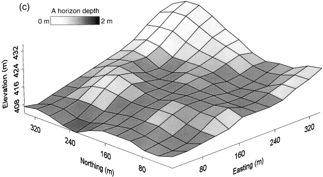
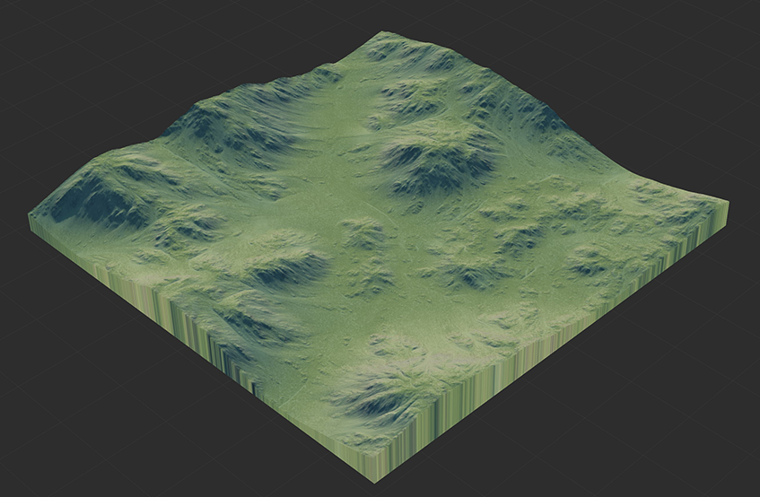
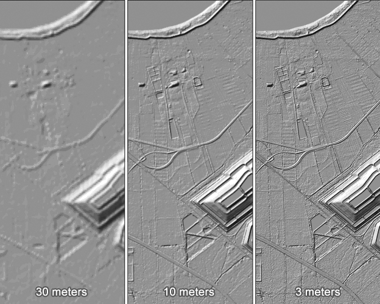
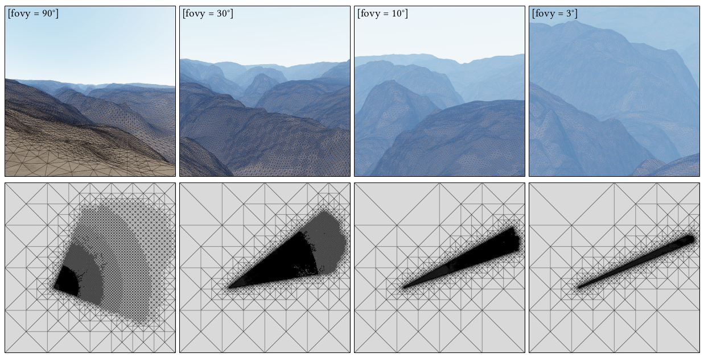
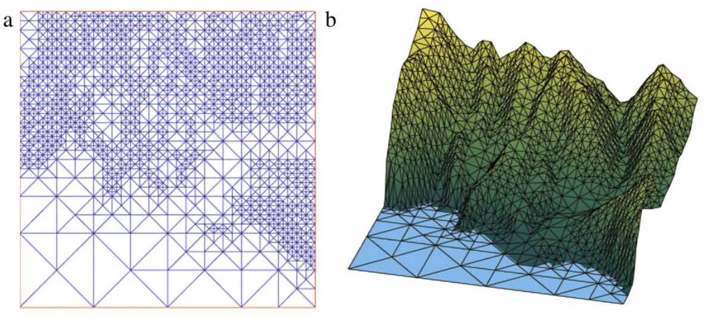
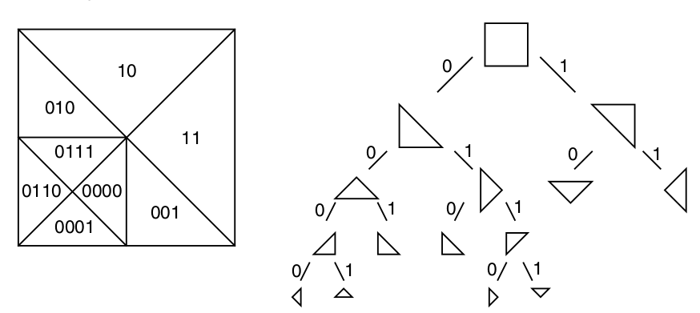
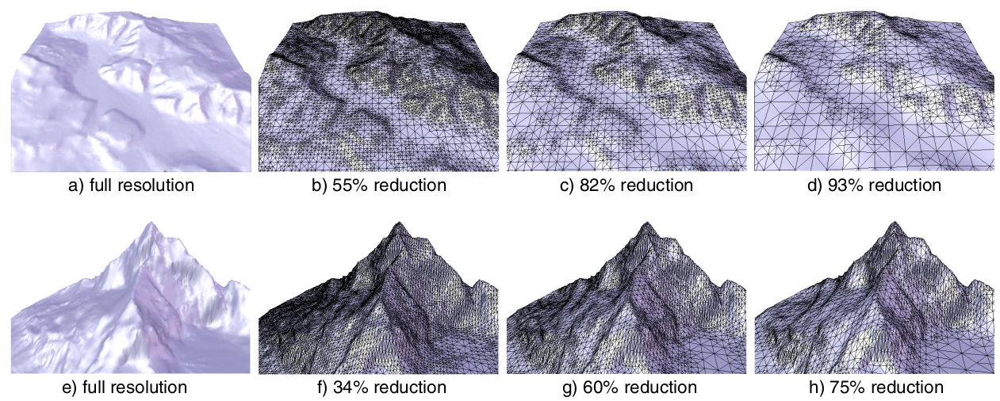
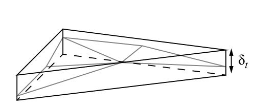
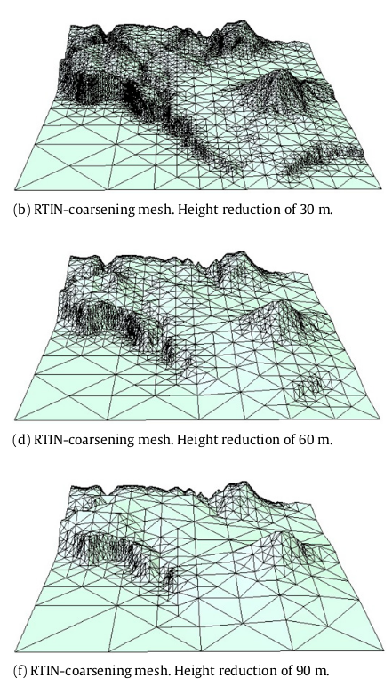

# Atividade 3 - Visualização de Terrenos para Jogos Eletrônicos

## Contexto

Um **Modelo Digital de Terreno** (**MDT**) ou *DTM - Digital Terrain Model* é definido como [2]:

> Uma estrutura de dados para armazenamento de informações de elevação de um terreno. Um **MDT** refere-se a uma grade regular e discreta, onde cada elemento da grade armazena uma amostra da elevação de uma região. São frequentemente usados em *Sistemas de Informações Geográficas* (*GIS*) e são a base mais comum para mapas de relevo produzidos digitalmente. 
> -- <cite>Wikipédia (adaptação livre)</cite>

A Figura 1 à esquerda mostra a grade regular (matrix) como a amostragem do **MDT**. Claramente essas amostras podem gerar uma aproximação da superfície do terreno em 3D. Com base nessa amostragem é possível visualizar essa aproximação da superfície de forma simples, desenhando 2 triangulos para cada região quadrada, como mostra a Figura 1 ao centro, ou aplicar algoritmos de renderização mais sofisticados e dar uma aparência mais realista ao terreno, como na Figura 1 à direita. 

*Figura 1 - Visões de um **MDT**: a grade regular e suas elevações (esquerda); a visualização da geometria da superfície representada (centro); e a aplicação de algoritmos de renderização para tornar o terreno mais realista (direita).*

Considerando o **MDT** como uma matriz de amostras de elevações, podemos armazena-la e visualiza-la na forma de uma imagem em tons de cinza, como mostra a Figura 2 'a esquerda. Cada valor de pixel corresponde a uma altura, que em geral varia de '0', corresponde ao nível mais baixo de elevação (em geral o nível do mar) até o valor '255', associado a maior altura do terreno. Na Figura 2 ao centro podemos ver novamente a interpretação renderizada da imagem/**MDT** da Figura 2 à esquerda. Por fim, a Figura 2 à direita mostra como o aumento do número de amostrar tem influência a resolução do terreno (sua escala) e nos detalhes capturados.  

*Figura 2 - Informações de um **MDT**: representação do **MDT** como imagem do (esquerda); a renderização desse terreno de forma realista (centro); e resoluções diferentes produzindo mais detalhes do terreno (direita).*

Terrenos são utilizados amplamente não só em aplicações científicas mas também na indústria do entretenimento, especialmente nos jogos eletrônicos. Nesse tipo de aplicação há que se atingir um compromisso entre detalhes do terreno (escala) e o custo computacional de seu processamento. 

Na Figura 3 podemos ver a aplicação de algoritmos de ajuste do nível de detalhes de um terreno em função da localização do observador (à esqueda) e de características do terreno (à direita). No primeiro caso podemos observar que na região visivel do terreno as representação do **MDT** torna-se mais densa. Mas mesmo nessa região, quanto mais distante as localizações menos detalhes são necessários. Na Figura 3 (à direita) o nĩvel de detalhe é guiado apenas pelo tipo de elemento de relevo do terreno. Locais mais planos ou com pouca variação de alturas são representados por triangulo menos refinado, enquanto que locais com alta variação e alturas possuem triangulos mais refinados. 

Esse tipo de abordagem, denominada Adaptativa [3] [4] permite enviar menos triangulos para serem desenhados mantendo uma taxa de apresentação de quadro (*framerate* ou *frames por segundo*) mais elevada do que se utilizássemos o terreno em sua resolução mais alta o tempo todo.  

*Figura 3 - Controle de NÍveis de Detalhe (LOD - Level of Detail) na visualização de um **MDT** para o contexto de jogos: (acima) LOD dependente do observador; (abaixo) LOD definido pelas características do terreno.*

A estrutura de dados que permite essa representação de regiões do terreno em níveis de detalhe diferentes é uma **Árvore Binária**, construida a partir da subdivisão do **MDT** completo. A Figura 4 mostra o processo de construção geométric (à esquerda) e a estrutura de dados correspondente (à direita). A partir do terreno quadrado, dois triangulos são gerados. Um processo de refinamento é aplicado em cada triangulo que não satisfaz algum critério de referencia (como os da Figura 3). O refinamento de um triangulo se dá sempre pela sua maior aresta (hipotenusa) e o vértice oposto (de angulo reto). Dessa forma o formato dos triangulos gerados é sempre o mesmo (isósceles retangulo) a menos de rotações e escalas. 

As alturas dos vértices de cada triangulo são obtidas a partir dos valores armazenados no **MDT**. Porém, cada triangulo define um plano passando por seus 3 vértices, que permite aproximar aquela região do terreno, gerando alturas aproximadas, avaliadas sobre esse plano. Como podemos observar na Figura 4, abaixo, para regiões do terreno com pouca alteração de alturas (uma planície por exemplo) um triangulo com área grande pode aproximar satisfatoriamente a região. Em locais mais irregulares, por outro lado, triangulos menores serão necessários para capturar as oscilações do terreno.    

*Figura 4 - Estrutura de subdivisão espacial de um **MDT**: o processo de subdivisão permite mapear regiões do plano em uma árvore binária (acima); a subdivisão espacial adaptativa permite regular a densidade de triangulos em cada região, a partir de um critério como comportamento do terreno (abaixo).*

## O Problema:

O objetivo dessa atividade é construir uma estrutura de dados capaz de representar um terreno em diversos níveis de detalhe, de acordo com dois critérios básicos:  

1. **Por Nível de Detalhe**: Ao estabelecer um nível de detalhe, todos os triangulos que representam o terreno para aquele nível devem ser desenhados. O nível de detalhe varia de 0 (apenas 2 triangulos) até o nível onde cada pixel é representado por 2 triangulos. Portanto, ao ler a imagem do terreno esse nível máximo pode ser determinado;

2. **Por Erro da Aproximação**: Nesse critério o usuário determina um valor de limiar de erro para que o triangulo represente bem o comportamento do terreno naquela região. Ou seja, como mostra a Figura 5 (acima), todas as amostras do terreno que se localizam dentro de um triangulo devem satifazer um certo limiar de erro, considerando a diferença entre a altura calculada no triangulo e o valor real da amostras. Nesse modo espera-se resultados similares aos das Figuras 5 (abaixo), onde quanto maior for o limiar de erro, mais fácil será um triangulo aproximar bem o comportamento do terreno em sua região.

*Figura 5 - A diferença entre as alturas das amostras e seu valor aproximado, na região definida pelo triangulo, não deve ser maior que um certo limiar epsilon (acima); regulando o valor do limiar é possível controlar o nível de detalhe da representação do terrreno (abaixo).*

## Código Base, Bibliotecas e Modelos de Terreno:

Nessa atividade utilizaremos a biblioteca *Pyglet* [8] para auxiliar no processo de leitura dos modelos de terreno (no formato de imagens) e para a visualização da estrutura de dados que representará o terreno. 

Nesse repositório é fornecido um código fonte base que possui funções para:

1. Carregar um **MDT** no formato de imagem;
2. Acessar os valores dos pixels/elevações; e
3. Desenhar triangulos na tela;

todas utilizando como base a biblioteca *Pyglet*.

Também nesse repositório encontram-se alguns modelos de terreno, no diretório 'code/DEMs', em formato .png e .jpg, alguns com suas versões renderizadas (apenas para ilustração). 

## Os Requisitos de implementação:

Seu programa deverá ser codificado na linguagem Python [5], utilizando os conceitos de **TAD/Classes/Objetos** e **Modularização**. 

**Estruturas de dados necessárias a solução do problema devem ser codificadas pelos alunos.**

Seu repositório deve conter um arquivo **README** com a documentação da solução adotada, escrito em Markdown [6], que deve conter: 
1. Justificativa para o uso das estruturas de dados escolhidas;
2. Uma breve analise da complexidade dos principais métodos utilizados;
3. Instruções de como utilizar o programa, caso necessário. 
	
A submissão do código do seu projeto será feita exclusivamente pelo repositório da dupla disponibilizado no *GitHub Classroom*. 

Procurem fazer `commits` e `pushs` regularmente, de modo a que seja possível acompanhar a evolução do código. 

>> **No caso de duplas, repositórios com desbalanceamento de atualizações implicará em forte indicio de desbalanceamento de esforço, e motivo de desbalanceamento na avaliação.**

Não serão aceitas submissões no *Google Classroom*, por e-mail ou qualquer outro meio eletrônico de envio. 

## Critérios de Avaliação e Entrega:

O trabalho será avaliado a partir dos seguintes critérios:

| Critério | Pontuação |
| :--- | :---: |
| 1. Construção da Estrutura de Dados | 3,0 | 
| 2. Visualização por nível de detalhe | 2,5 |
| 3. Visualização por erro da aproximação | 2,5 |
| 4. Apresentação do projeto | 2,0 |
| 5. Penalidades: |  |
| Entrega fora do prazo | 1,0 por dia |
| Não fornecer um Relatório Técnico (README) | até 0,5 |
| Não utilizar TADs/Classes [7] | até 1,5 |
| Não utilizar Modularização[7] | até 1,0 |
| Desbalanceamento nas atualizaçõe do repositório | até 2,0 |

A data de submissão será dia **04/07** e a apresentação para os professor/monitores/estagiário docente será no dia **06/07**  

>> **A cooperação entre alunos é considerada salutar. No entanto, trabalhos com alto grau de similaridade serão tratados como “plágio”, o que resultará em avaliação 0 (zero) para todos os envolvidos.**. 

>> **Qualquer dúvida adicional, evite problemas: não presuma nada, procure o professor para esclarecimentos.**

## Referencias Bibliográficas:

[1] Cormen,T.H., Leiserson,C.E., Rivest,R.L., Stein,C. **Algoritmos – Teoria e Prática**. Editora Campus. 3a Edição, 2012.

[2]	Wikipedia. **Digital Elevation Model**. disponível em: https://en.wikipedia.org/wiki/Digital_elevation_model

[3]		De Floriani, Leila, and Paola Magillo. [**"Regular and irregular multi-resolution terrain models: A comparison."**](./biblio/3.pdf) In Proceedings of the 10th ACM international symposium on Advances in geographic information systems, pp. 143-148. 2002.

[4]		Pajarola, Renato. [**"Overview of quadtree-based terrain triangulation and visualization."**](./biblio/4.pdf) (2002). 

[5] 	Canning, J., Broder, A., Lafore, R. **Data Structures & Algorithms in Python**. Addison-Wesley. 2022. 

[6] 	**Markdown Guide**. Disponível em: https://www.markdownguide.org/basic-syntax/

[7]		**Boas Práticas de Programação**. Disponível em: https://liag.ft.unicamp.br/programacao2/boas-praticas-de-programacao/

[8]		**Pyglet**. Disponível em: https://pyglet.org/
